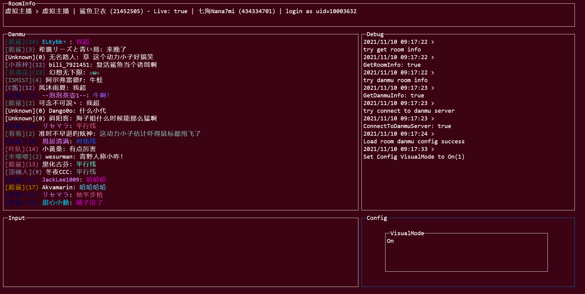

# Blivechat

[项目主页](https://bbs.nga.cn/read.php?tid=29364231)

## 使用教程

### 启动

```shell
# 不登陆
blivechat <房间id>

# 如果同目录下存在blivechat.ini，会自动使用保存的登录信息
blivechat <房间id>

# 登陆, 并把登录信息保存在blivechat.ini里
blivechat  <房间id> <uid> <sessdata> <bilijct>

# 指定使用哪个config
blivechat <房间id> --c=config.ini

```

登录信息默认保存在`blivechat.ini`里,

### 使用



tab切换面板，`Enter`发送，`Ctrl+c`退出  
修改弹幕设置: 切换到`config`后摁左右键切换设置，上下键更改设置。  
设置:  
`VisualColorMode`: 是否显示彩字  
`ShowMedal`: 是否显示粉丝牌  
`ShowDebug`: 是否显示调试信息  
`DanmuColor`: 发送的弹幕颜色  
`DanmuMode`: 发送的弹幕形式  

## 从源码构建

```shell
git clone https://github.com/aynakeya/blivechat.git
cd blivechat/app/chat
go build blivechat.go
```
